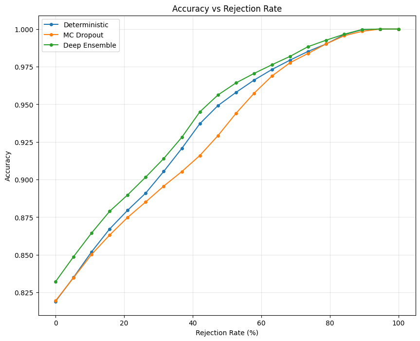
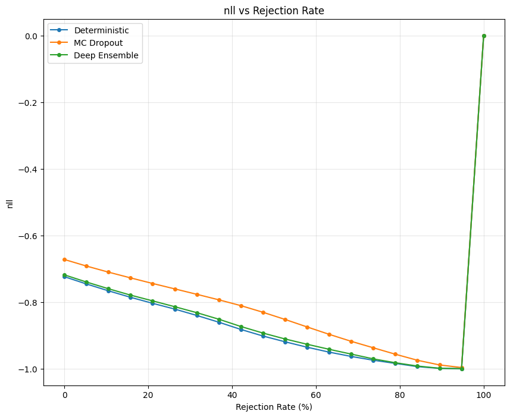
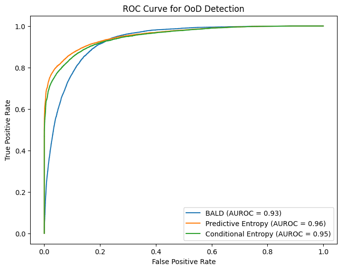
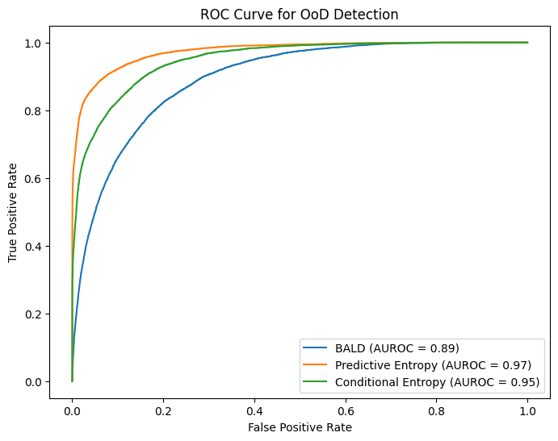

### **README.md**

# Comparing Uncertainty Methods Using Bayesian Neural Networks

This project focuses on comparing different uncertainty estimation methods applied to the Dirty-MNIST, MNIST, and Fashion-MNIST datasets using a Bayesian neural network (LeNet5 with dropout). The tasks involve model training, classification with rejection, out-of-distribution (OoD) detection, and density-based uncertainty estimation.

## Table of Contents
1. [Overview](#overview)
2. [Requirements](#requirements)
3. [Project Structure](#project-structure)
4. [Tasks and Results](#tasks-and-results)
    - [Task 1: Model Training and Evaluation](#task-1-model-training-and-evaluation)
    - [Task 2: Classification with Rejection](#task-2-classification-with-rejection)
    - [Task 3: Rejection Curve Analysis](#task-3-rejection-curve-analysis)
    - [Task 4: OoD Detection](#task-4-ood-detection)
    - [Task 5: Density-Based Uncertainty](#task-5-density-based-uncertainty)
5. [Visualizations](#visualizations)
6. [How to Run](#how-to-run)

---

## Overview

We compare uncertainty estimation methods:
1. **Deep Ensembles**
2. **MC Dropout**
3. **Deterministic Model (No Dropout)**

### Key Objectives:
1. **Uncertainty Estimation:** Compare epistemic (BALD) and aleatoric uncertainties.
2. **Rejection Curves:** Analyze performance (accuracy and NLL) versus rejection rates.
3. **OoD Detection:** Compare methods for detecting out-of-distribution samples.
4. **Density-Based Uncertainty:** Mahalanobis distance-based uncertainty evaluation.

---

## Requirements

Install dependencies using the provided `requirements.txt`:
```bash
pip install -r requirements.txt
```

---

## Project Structure

```
Comparing_Uncertainty_Methods/
├── data_utils.py       # Dataset loading utilities
├── models.py           # Model architecture definitions
├── train.py            # Model training script
├── evaluate.py         # Evaluation and uncertainty analysis
├── visualize.py        # Visualization tools
├── requirements.txt    # Required Python packages
└── results/            # Folder for storing outputs (plots and saved models)
```

---

## Tasks and Results

### Task 1: Model Training and Evaluation
- Train models using Dirty-MNIST’s training set.
- Evaluate accuracy and NLL on MNIST’s test set for:
  - Deep Ensembles
  - MC Dropout
  - Deterministic Model
- Results:

| Method          | Accuracy | NLL  |
|------------------|----------|------|
| Deep Ensembles   | *0.989* | *0.0367* |
| MC Dropout       | *0.99* | *0.04* |
| Deterministic    | *0.988* | *0.067* |

---

### Task 2: Classification with Rejection

- Classification with rejection is implemented by ranking predictions based on their uncertainty (epistemic or aleatoric) and rejecting the least confident ones. For each rejection rate, the retained predictions are evaluated in terms of accuracy.

#### **How It Was Calculated**:
1. **Uncertainty Metrics**:
   - **Epistemic Uncertainty (BALD)**: Estimated using mutual information between predictions and model parameters.
   - **Aleatoric Uncertainty**: Measured as the expected entropy of individual model predictions.
   
2. **Rejection Process**:
   - Predictions were ranked based on their uncertainty (highest to lowest).
   - A percentage of predictions with the highest uncertainty was rejected (rejection rate).
   - Accuracy was computed for the remaining predictions.

3. **Evaluation**:
   - This process was repeated across different rejection rates (e.g., 0% to 100%), and accuracy was plotted against the rejection rate for comparison.

---

### Task 3: Rejection Curve Analysis

- The plot below shows the **Accuracy vs. Rejection Rate** for the three methods (Deterministic, MC Dropout, Deep Ensemble):



#### **Observations**:
1. **Accuracy Increases with Rejection**:
   - As the rejection rate increases, accuracy improves for all methods.
   - This is expected since rejecting uncertain predictions ensures only confident predictions are retained.

2. **Method Performance**:
   - **Deep Ensemble** consistently achieves the highest accuracy due to the diversity in predictions from multiple models.
   - **MC Dropout** improves accuracy by leveraging stochasticity during inference but performs slightly worse than Deep Ensemble.
   - **Deterministic Model** exhibits the lowest accuracy, as it lacks a mechanism to quantify uncertainty.

3. **Convergence**:
   - At high rejection rates (>70%), all methods converge in accuracy, as predictions focus only on the most certain samples.

#### **Application Insight**:
Rejection-based classification is useful in scenarios where high accuracy is essential, such as medical diagnosis, by abstaining from uncertain predictions.

---
#### **NLL vs. Rejection Rate**
- The plot below shows the **Negative Log Likelihood (NLL) vs. Rejection Rate** for the three methods:



#### **Observations**:
1. **NLL Decreases with Rejection**:
   - The NLL decreases steadily as the rejection rate increases for all methods, indicating improved confidence in predictions.
   - For **Deep Ensemble**, the decrease in NLL is more pronounced compared to other methods.

2. **Method Performance**:
   - **Deep Ensemble** achieves the lowest NLL due to its ability to average predictions across models, leading to more calibrated probabilities.
   - **MC Dropout** shows better NLL compared to the Deterministic model but lags behind Deep Ensemble.
   - **Deterministic Model** has the highest NLL, as it does not account for uncertainty during inference.

3. **Behavior at 100% Rejection**:
   - At 100% rejection, the plot exhibits a spike or undefined behavior for some methods (e.g., Deep Ensemble) due to no samples being included for evaluation.

#### **Application Insight**:
Analyzing NLL with rejection provides a deeper understanding of model calibration. Lower NLL values indicate better-calibrated predictions, which is crucial for risk-sensitive applications like autonomous driving.

---

### Task 4: Implementing Out-of-Distribution (OoD) Detection

#### **What is OoD Detection?**
Out-of-distribution (OoD) detection refers to the task of identifying whether a given input comes from the same distribution as the data used to train a model or from a completely different (out-of-distribution) dataset. In this context:
- **In-Distribution (ID):** Samples from Dirty-MNIST.
- **Out-of-Distribution (OoD):** Samples from Fashion-MNIST.

The goal is to evaluate how well the uncertainty methods can differentiate between ID and OoD samples by leveraging:
1. **Epistemic Uncertainty (BALD):** Measures the model's lack of knowledge about the data due to limited training data.
2. **Aleatoric Uncertainty:**
   - **Predictive Entropy:** Measures uncertainty inherent in the data.
   - **Conditional Entropy:** Focuses on model uncertainty conditioned on the input.

#### **How It Was Calculated**
1. **Uncertainty Metrics**:
   - Compute epistemic uncertainty (BALD) and aleatoric uncertainty (predictive and conditional entropy) for each sample.
   - Combine uncertainties from ID and OoD datasets.
2. **Labeling**:
   - Assign labels:
     - **0:** For Dirty-MNIST (ID samples).
     - **1:** For Fashion-MNIST (OoD samples).
3. **ROC Curve and AUROC**:
   - Plot the Receiver Operating Characteristic (ROC) curve for each uncertainty metric.
   - Compute the Area Under the ROC Curve (AUROC), which quantifies the model's ability to distinguish between ID and OoD samples.

---

#### **Results**

**Deep Ensemble (Epistemic and Aleatoric Uncertainties):**
- **AUROC Scores:**
  - BALD: 0.89
  - Predictive Entropy: 0.97
  - Conditional Entropy: 0.95
- **ROC Curve**:
  

**MC Dropout (Epistemic and Aleatoric Uncertainties):**
- **AUROC Scores:**
  - BALD: 0.93
  - Predictive Entropy: 0.96
  - Conditional Entropy: 0.95
- **ROC Curve**:
  

---

#### **Analysis**

1. **Model Performance**:
   - **Predictive Entropy** achieves the highest AUROC scores across both Deep Ensemble and MC Dropout methods.
   - **Conditional Entropy** also performs well, suggesting that aleatoric uncertainty metrics are highly effective in distinguishing ID from OoD samples.
   - **BALD** achieves slightly lower AUROC scores, likely due to its focus on model uncertainty rather than data noise.

2. **Deep Ensemble vs. MC Dropout**:
   - MC Dropout slightly outperforms Deep Ensemble in terms of AUROC for BALD, indicating that it captures epistemic uncertainty more effectively in this scenario.
   - Both methods perform comparably for aleatoric uncertainty metrics.

3. **ROC Curves**:
   - The ROC curves for Predictive Entropy and Conditional Entropy demonstrate a steeper ascent towards the True Positive Rate (TPR), reflecting their superior performance in identifying OoD samples.

4. **Application Insight**:
   - OoD detection is critical for deploying machine learning models in real-world scenarios where they may encounter unexpected inputs. The high AUROC scores for aleatoric uncertainty metrics suggest their reliability in such tasks.

---


## How to Run

1. **Train Models**:
   ```bash
   python train.py
   ```

2. **Evaluate Models**:
   ```bash
   python evaluate.py
   ```

3. **Generate Visualizations**:
   ```bash
   python visualize.py
   ```

4. **Run OoD Detection Notebook**:
   Open `ood_detection_density_uncertainty.ipynb` in Jupyter or Colab.

---
